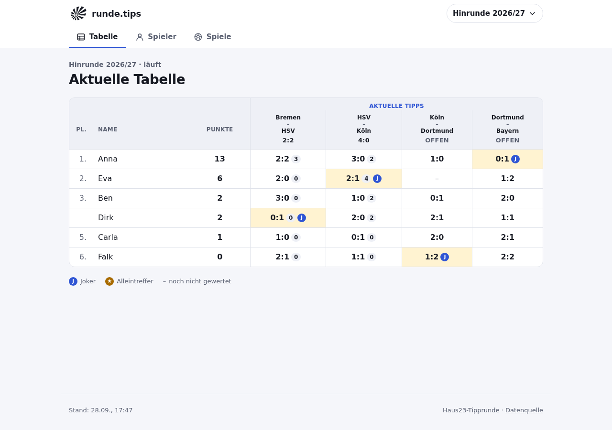
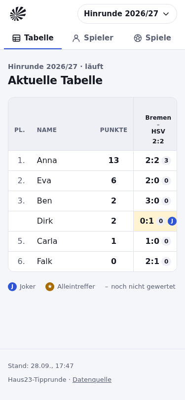
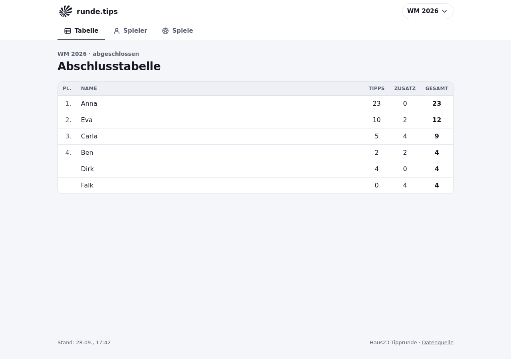
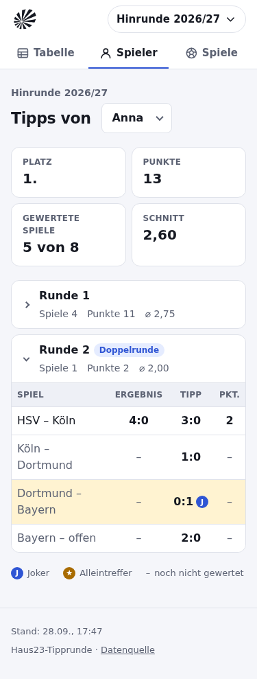
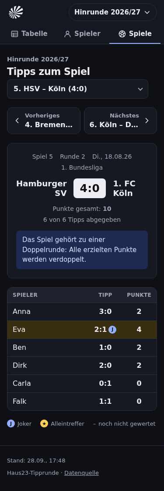

# Verifikation

Stand: 28.09.2026. Alle Prüfungen lokal im Cloud-Container ausgeführt.

## Nicht durchführbar: reale API

`unterbau.runde.tips` war aus der Entwicklungsumgebung nicht erreichbar
(Netzwerk-Richtlinie, HTTP 403 am Egress-Proxy). Deshalb:

- Vertrag aus dem Unterbau-Quellcode übernommen (siehe [FINDINGS.md](FINDINGS.md)).
- Alle Laufzeitprüfungen gegen synthetische Daten nach diesem Vertrag
  (`test/fixtures.ts`, auch als Mock-API: `npm run mock-api`).
- **Offen:** `npm run verify:live` gegen die echte API. Das Skript rendert für
  jedes veröffentlichte Turnier alle Routenvarianten, prüft Standard- und
  explizite Auswahl, Prev/Next-Ränder und Fallbacks; jede Vertragsverletzung
  der echten Daten fiele als 502 auf. Gegen die Mock-API: 55/55 bestanden.

## Statische Prüfung, Tests, Build

| Prüfung | Ergebnis |
| --- | --- |
| `npm run lint` (Biome) | ohne Befund |
| `npm run typecheck` (tsc strict, `noUncheckedIndexedAccess`; Client per `checkJs`) | ohne Befund |
| `npm test` (node:test) | 62/62 bestanden |
| `npm run build` (`wrangler deploy --dry-run`) | erfolgreich |

Build-Größen (gzip): Worker 15 KB · CSS 3,9 KB · JS 3,0 KB · Logo 1,3 KB ·
HTML pro Seite 2,2–2,5 KB.

Die Tests decken ab:

- aktuelles Turnier = höchste `nr`, unabhängig von der API-Reihenfolge
- Slug-Auflösung, unbekannte Slugs und Pfade → 404, Slash-Redirect
- Standardauswahl Spieler (Tabellenführer, geteilter Rang, ohne Ranking) und
  Spiel (letztes gewertetes nach Datum, ohne gewertetes, ohne Spiele)
- explizite Auswahl per `?name=` / `?nr=`; ungültige Werte (`999`, `abc`, `0`,
  `-2`, unbekannte Namen, HTML im Wert) → Standard + Hinweis + URL-Bereinigung
- Prev/Next inkl. erstem und letztem Spiel
- Turnierwechsel überträgt keine Auswahl
- Empty States: keine Turniere, keine Teilnehmer, keine Spiele, kein Ranking,
  nichts gewertet; offene Teams
- Tippzustände: kein Tipp / noch kein Tipp / 0 Punkte / nicht gewertet, Joker,
  Alleintreffer
- API-Fehler: HTTP 500 → 502-Seite, Netzwerkfehler → 503-Seite, ungültiges
  JSON/Schema → 502-Seite; E-Mail-Adressen werden nie ausgegeben
- SWR: frisch, stale + Hintergrund-Revalidierung, Blockieren nach Ablauf,
  Notreserve bei Fehlern, ungültige Daten verdrängen keine gültigen, bedingte
  Requests (304), Cache-Schreibvorgänge über `waitUntil`
- ETag/304 für HTML, 405 für andere Methoden

## Browser (Chromium via Playwright, `wrangler dev` + Mock-API)

- Alle sechs Routenvarianten plus Deep Links mit `?name=`/`?nr=`, Reload stabil.
- Prev/Next: am ersten Spiel kein „Vorheriges“, am letzten kein „Nächstes“;
  Klick und Enter aktualisieren `?nr=`; Auswahlfeld folgt.
- Auswahlfelder: Maus/Touch navigiert sofort; Pfeiltasten navigieren nicht bei
  jedem Schritt, sondern erst mit Enter/Verlassen (Schaltfläche „Anzeigen“
  erscheint).
- Ungültiges `?nr=999` / `?name=nobody`: Hinweis sichtbar, Parameter aus der
  Adresszeile entfernt.
- Turnierwechsel: per Tastatur öffnen, Escape schließt und fokussiert den
  Auslöser, Klick außerhalb schließt; `/wm2026/spieler?name=carla` →
  „Hinrunde 2026/27“ führt zu `/spieler` (ohne `name`).
- Tastatur: erster Tab-Stopp ist der Skip-Link, er fokussiert `<main>`; sichtbare
  Fokusringe.
- Kein horizontales Scrollen der Seite bei 375 px und 1280 px (breite Tabellen
  scrollen in ihrem Container); helles und dunkles Farbschema.
- Revalidierung: geänderte Daten werden bei Fokus eingetauscht, Aufklappzustände
  bleiben, Hinweis „Daten aktualisiert“, Auswahlfelder funktionieren weiter.
- Offline: Hinweis bei `offline`, verschwindet bei `online`. Mit Service Worker
  und gestopptem Server: besuchte Seite aus dem Cache mit Offline-Hinweis, nie
  besuchte Seite → Offline-Seite.
- Keine Konsolenfehler (außer den erwarteten Meldungen der Offline-Simulation).

Nicht automatisiert geprüft: echte Screenreader, Safari/Firefox, echte
Touch-Geräte, Cloudflare-Produktionsumgebung (Cache API auf eigener Domain).

## Screenshots

| | |
| --- | --- |
|  |  |
|  |  |
|  | |
